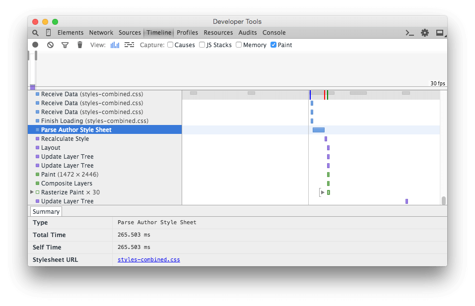

# Media query performance

To test the browser rendering time of media queries, 2 stylesheets file were created with a php script [render-media-query.php](render-media-query.php).

The files [styles-combined.css](styles-combined.css) and [styles-media-queries.css](styles-media-queries.css) has the same amount of styles in them.
 
The only difference is that `styles-media-queries.css` has only one grouped media query, and `styles-combined.css` has the same media query around each class.

Of course the size of the stylesheets files differ: 9.6M vs 12.5MB. `styles-media-queries.css` is 30% larger than `styles-combined.css`.

However, as you can see from the Developer Tools example, the parsing time of style sheets: 265.5ms vs 416.9ms. It does take *57%* more time to parse the unoptimized version of the stylesheets file.

This is in no way a real world example, I'm sure, and do hope, that no site will ever have 99999 style classes.